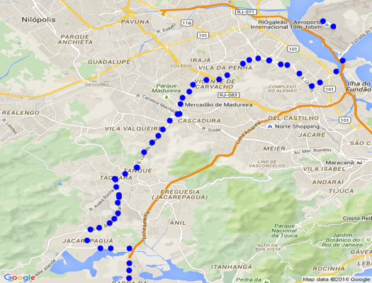

# riodata

## About 

`riodata` allows you to access certain data from [data.rio](http://data.rio/). 

## How to use

example:

     get_data("brt")

Available dataset names: "brt", "supervia", "pontosculturais", "metro"

## Example 

    library(RgoogleMaps)
    library(riodata)

    df <- get_data("brt")

    head(df)
    dim(df)
    str(df)
    colnames(df)

    df$LATITUDE <- as.numeric(levels(df$LATITUDE))[df$LATITUDE]
    df$LONGITUDE <- as.numeric(levels(df$LONGITUDE))[df$LONGITUDE]

    #The first step naturally will be to download a static map from the Google server. A simple example:

    lat = df$LATITUDE;
    lon = df$LONGITUDE;
    center = c(mean(lat), mean(lon));
    zoom <- min(MaxZoom(range(lat), range(lon)));

    #this overhead is taken care of implicitly by GetMap.bbox();

    MyMap <- GetMap(center=center,
                    zoom=zoom,
                    markers = paste0("&markers=color:blue|label:S|",
                                      "40.702147,-74.015794&markers=color:green|label:G|40.711614,-74.012318&markers=",
                                      "color:red|color:red|label:C|40.718217,-73.998284"), destfile = "MyTile1.png");

    tmp <- PlotOnStaticMap(MyMap, lat = lat,
                           lon = lon,
                           destfile = "MyTile1.png", cex=1.5,pch=20,
                           col='blue', add=FALSE);

    #and add lines:

    PlotOnStaticMap(MyMap, lat = c(40.702147,40.711614,40.718217),
                    lon = c(-74.015794,-74.012318,-73.998284),
                    lwd=1.5,col=c('red', 'blue', 'green'), FUN = lines, add=TRUE)

## Install

    devtools::install_github("ropenscilabs/riodata")

